# 🧩 kubernetes-eks-hands-on
An end‑to‑end Kubernetes project on Amazon EKS, covering cluster creation with eksctl, IAM OIDC integration, Helm setup, sample application deployment, and AWS Load Balancer Controller configuration.
****
# ⚙️ Prerequisites
Before starting, ensure the following tools are installed and configured:

kubectl – Command‑line tool for interacting with Kubernetes clusters.
Refer to the official documentation for installation and updates.

eksctl – Command‑line utility for managing EKS clusters and automating setup tasks.
See installation instructions in the eksctl documentation.

AWS CLI – Command‑line interface for AWS services, including Amazon EKS.
After installation, configure it using aws configure.
****
# 🧰 Install kubectl on Linux
```bash
curl -LO "https://dl.k8s.io/release/$(curl -L -s https://dl.k8s.io/release/stable.txt)/bin/linux/amd64/kubectl"
sudo install -o root -g root -m 0755 kubectl /usr/local/bin/kubectl
kubectl version --client
```
# 🧰 Install eksctl
```bash
# For ARM systems, set ARCH to: arm64
ARCH=amd64
PLATFORM=$(uname -s)_$ARCH
curl -sLO "https://github.com/eksctl-io/eksctl/releases/latest/download/eksctl_$PLATFORM.tar.gz"
# (Optional) Verify checksum
curl -sL "https://github.com/eksctl-io/eksctl/releases/latest/download/eksctl_checksums.txt" | grep $PLATFORM | sha256sum --check
tar -xzf eksctl_$PLATFORM.tar.gz -C /tmp && rm eksctl_$PLATFORM.tar.gz
sudo install -m 0755 /tmp/eksctl /usr/local/bin && rm /tmp/eksctl
```
****
# ☁️ Create EKS Cluster (Using Fargate)
```bash
eksctl create cluster --name demo-cluster --region us-east-1 --fargate
```
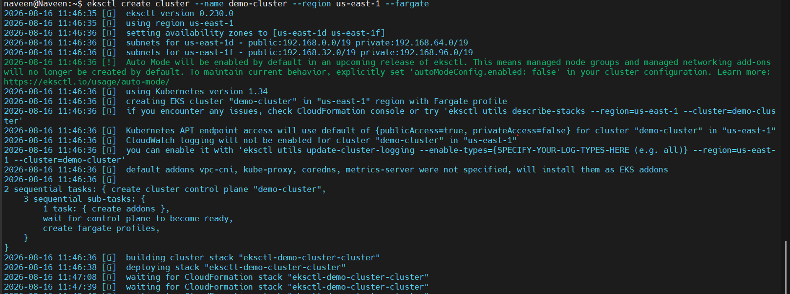

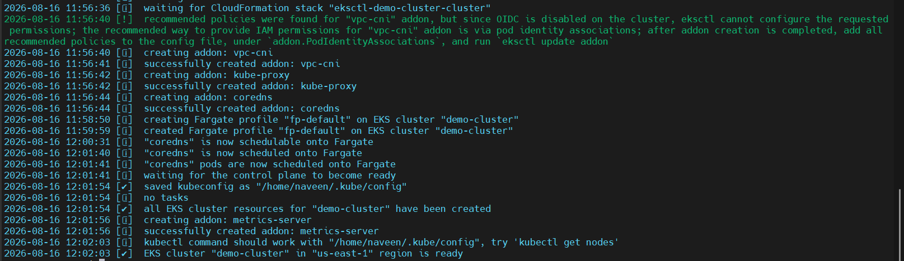

After creation, verify the cluster, CloudFormation stack, and VPC in the AWS Console.


Update your local kubeconfig to interact with the cluster:
```
aws eks update-kubeconfig --name demo-cluster --region us-east-1
```
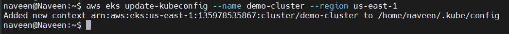

# 🎮 Deploy the 2048 Sample App

## Create Fargate Profile
```
eksctl create fargateprofile \
    --cluster demo-cluster \
    --region us-east-1 \
    --name alb-sample-app \
    --namespace game-2048
```
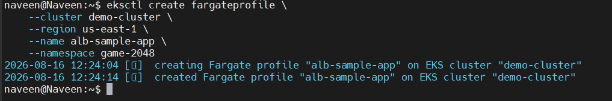


## Deploy deployment, Service, and Ingress

```bash
kubectl apply -f https://raw.githubusercontent.com/kubernetes-sigs/aws-load-balancer-controller/v2.5.4/docs/examples/2048/2048_full.yaml
```
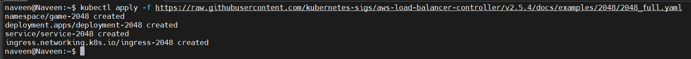

Verify pods, services, and ingress:
```bash
kubectl get pods -n game-2048
kubectl get svc -n game-2048
kubectl get ingress -n game-2048
```

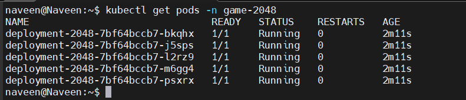

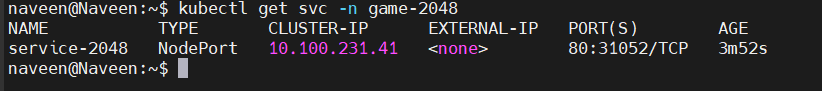

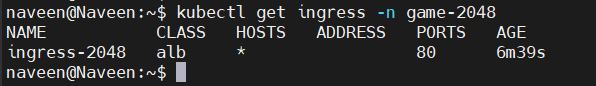

****
# 🔐 Configure IAM OIDC Provider

```bash
eksctl utils associate-iam-oidc-provider \
  --cluster demo-cluster \
  --region us-east-1 \
  --approve
```
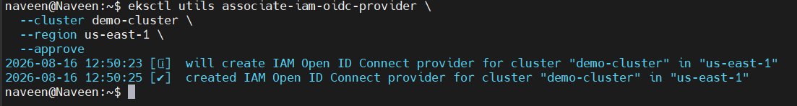

# 🧾 Setup AWS Load Balancer Controller

## Download IAM Policy

```bash
curl -O https://raw.githubusercontent.com/kubernetes-sigs/aws-load-balancer-controller/v2.11.0/docs/install/iam_policy.json
```
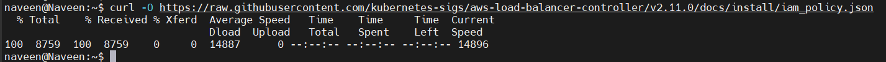

## Create IAM Policy

```bash
aws iam create-policy \
    --policy-name AWSLoadBalancerControllerIAMPolicy \
    --policy-document file://iam_policy.json
```
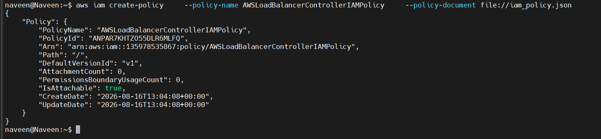

## Create IAM Role for Service Account

```bash
eksctl create iamserviceaccount \
  --cluster=<your-cluster-name> \
  --namespace=kube-system \
  --name=aws-load-balancer-controller \
  --role-name AmazonEKSLoadBalancerControllerRole \
  --attach-policy-arn=arn:aws:iam::<your-aws-account-id>:policy/AWSLoadBalancerControllerIAMPolicy \
  --approve
```
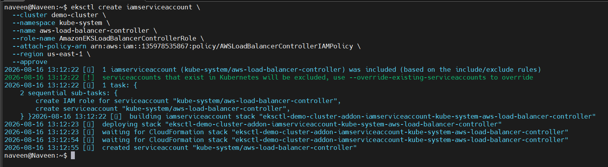

# ⚙️ Deploy AWS Load Balancer Controller via Helm

## Add Helm Repository

```bash
helm repo add eks https://aws.github.io/eks-charts
helm repo update eks
```

## Install Controller

```bash
helm install aws-load-balancer-controller eks/aws-load-balancer-controller -n kube-system \
  --set clusterName=<your-cluster-name> \
  --set serviceAccount.create=false \
  --set serviceAccount.name=aws-load-balancer-controller \
  --set region=<your-region> \
  --set vpcId=<your-vpc-id>
```
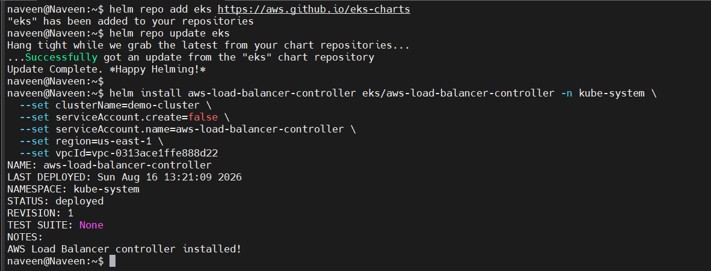

Verify deployment:

```bash
kubectl get deployment -n kube-system aws-load-balancer-controller
```
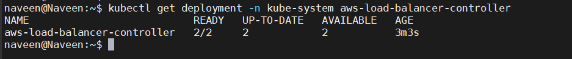

# 🌐 Verify Load Balancer and Ingress

Check the ALB in the AWS Console, then confirm the ingress address:


```bash
kubectl get ingress -n game-2048
```
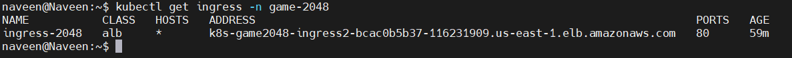

Open the ingress address in your browser — you should see the 2048 game running successfully.


# 🧹 Cleanup
After testing, delete the cluster to avoid unnecessary costs:

```bash
eksctl delete cluster --name demo-cluster --region us-east-1
```

